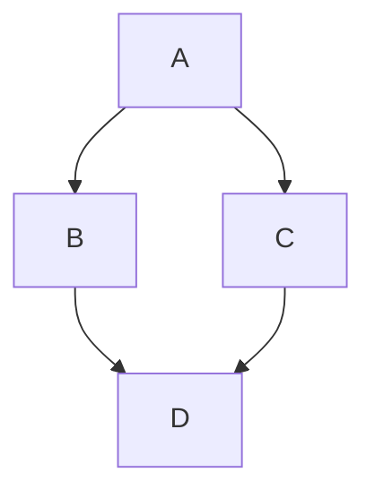

# What you can use in a post

Everything below is already enabled site-wide in `_config.yml` — no extra front matter needed unless noted.

## Math (MathJax)

`mathjax: true` is enabled globally. Wrap math in `$$...$$` (used for both inline and display equations by this theme's MathJax config):

```tex
When $$a \ne 0$$, there are two solutions to $$ax^2 + bx + c = 0$$ and they are

$$x_1 = {-b + \sqrt{b^2-4ac} \over 2a}$$

$$x_2 = {-b - \sqrt{b^2-4ac} \over 2a} \notag$$
```

`mathjax_autoNumber: true` is also enabled, so display equations are numbered automatically — add `\notag` (or `\nonumber`) after an equation to opt it out.

## Diagrams (Mermaid)

`mermaid: true` is enabled globally. Fence the diagram as `mermaid`:

<pre>

</pre>

Flowcharts, sequence diagrams, Gantt charts, and everything else [Mermaid](https://mermaidjs.github.io/) supports work the same way.

## Charts (Chart.js)

`chart: true` is enabled globally. Fence a [Chart.js](https://www.chartjs.org/) config as `chart`:

<pre>
```chart
{
  "type": "bar",
  "data": {
    "labels": ["Red", "Blue", "Yellow"],
    "datasets": [{ "label": "# of Votes", "data": [12, 19, 3] }]
  },
  "options": {}
}
```
</pre>

Any Chart.js `type` (`line`, `bar`, `radar`, `pie`, `doughnut`, `polarArea`, `bubble`, ...) works — the fenced block is just that chart's JSON config.

## Syntax-highlighted code

Fenced code blocks (` ```lang `) are highlighted automatically. For line numbers and highlighting specific lines, use the Liquid `highlight` tag directly:

```liquid

one: 1
two: 2
three: 3
four: 4

```

`mark_lines` takes a space-separated list of 1-indexed line numbers to highlight — useful when your prose says "note line 2 and 4" right after the block.

## Footnotes and tables

Standard kramdown syntax:

```markdown
Here's a claim that needs a citation.[^1]

[^1]: Here's the citation.

| Column A | Column B |
|---|---|
| foo | bar |
```

## Table of contents

Every post already gets a floating table of contents (`aside: { toc: true }` is set site-wide in `_config.yml`'s post defaults) — it's built automatically from the post's headings, no action needed.

## Embedding a YouTube video

```liquid
<div></div>
```

`VIDEO_ID` is the part after `v=` in a YouTube URL.

## Comments

Every post gets a giscus comment thread by default — no front matter needed. To disable comments on one specific post, add `comment: false` to its front matter (see [writing-posts.md](writing-posts.md)); every other post is unaffected.

## Images

- **Cover image** (`cover:` front matter, used as the post's hero background and its listing thumbnail): just point it at a file under `assets/images/`. The build automatically recompresses it, generates a `.webp` version, and generates a small `-thumb` variant in both formats for listing use — you don't create any of those yourself (see [architecture.md](architecture.md)).
- **Inline images in the post body**: use a local path like ``. Don't link to an image via its absolute `https://raw.githubusercontent.com/...` URL — even though that happens to work, it bypasses the optimization pipeline above entirely (the image never gets compressed or converted to WebP for that use).
